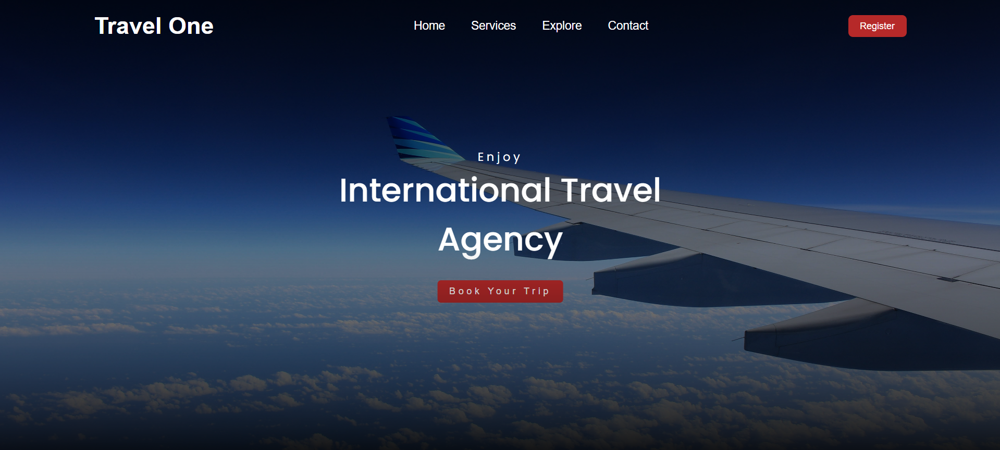

# ✈️ Travel One - International Travel Agency Website

## 📌 Overview
**Travel One** is a responsive travel agency landing page built using HTML and CSS.  
It features a full-screen hero section with a blurred background, smooth typography, and a modern navigation menu.  
The design is optimized for desktop, tablet, and mobile devices.

## 🚀 Features
- 🌆 Full-screen hero section with a background image and gradient overlay
- 📜 Clean and minimal navigation bar
- 🎯 Call-to-action button ("Book Your Trip")
- 📱 Fully responsive design for mobile, tablet, and desktop
- 🎨 Hover effects for links and buttons
- 🎭 Bottom gradient overlay for better text visibility

## 🛠 Tech Stack
- **HTML5**
- **CSS3 (Flexbox, Media Queries, Pseudo-elements)**
- **Google Fonts** (`Poppins` and `Cedarville Cursive`)
